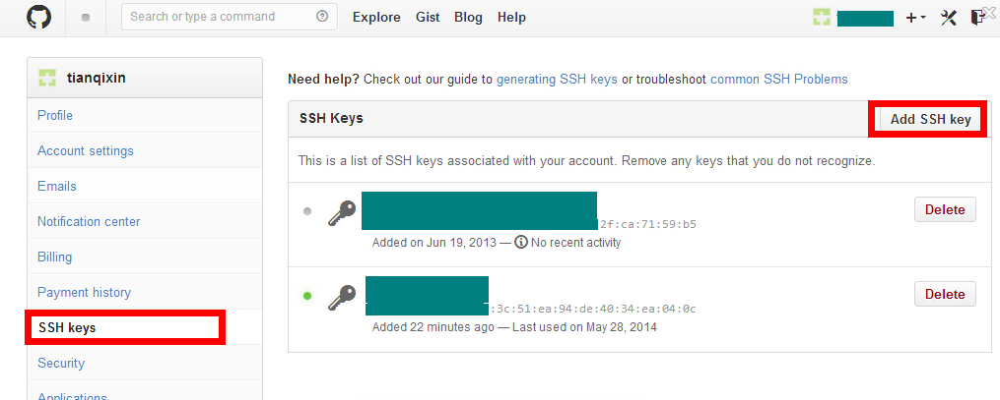

# github入门使用  


git bash下载、github注册账号什么的就不讲了<br>
主要参考:  
[git | 菜鸟教程](http://www.runoob.com/git/git-tutorial.html) 

---
## 一、生成公钥、私钥并设置github认证  
### 生成公钥私钥：
1、打开git bash
输入```ssh-keygen -t rsa -C "your_email@youremail.com"```  
2、生成的公钥私钥会在系统用户目录下的```.ssh```文件夹内 
### 设置github认证 
3、打开```id_rsa.pub```文件，复制里面的key，进入github账号个人设置，如下图  

4、验证是否成功，在git bash命令窗中输入 `ssh -T git@github.com`  
如果是第一次的会提示是否continue，输入yes就会看到：  
You've successfully authenticated, but GitHub does not provide shell access 。这就表示已成功连上github。  
5、设置用户名(`username`):  `git config --global user.name "your name"`  
邮箱(`email`): `git config --global user.email "your_email@youremail.com"`


## 二、github使用
### 新建github仓库
+ 跟着github的提示一路下一步咯
### clone仓库到本地
1、复制github仓库里clone or download按钮下的信息，如：  
`git@github.com:your_name/repo_name.git`  
2、在本地目标存放文件夹下打开git bash，输入：  
`git clone git@github.com:your_name/repo_name.git`  
即可检出对应仓库。
### 添加文件并push到远程仓库
1、创建需要提交的文件后，在本地仓库文件夹内打开git bash  
2、查看文件状态：`git status [-s]`，加了-s输出简要信息，不加输出完整信息  
3、提交文件缓存（感觉意思就是把本地修加入git配置文件里，方便后续推流到远程仓库）：``git commit -m `记录信息` `` 或者 `git commit -a` 直接提交  
4、推送到远程仓库 `git push origin master` ，直接推到master分支里，下一篇实践git上面的分支、合并。

